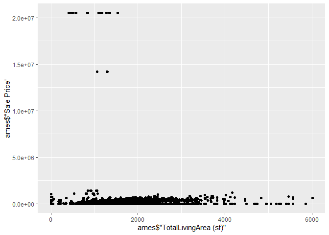
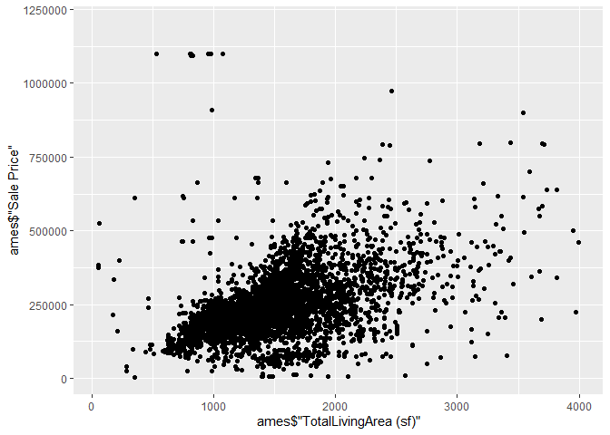
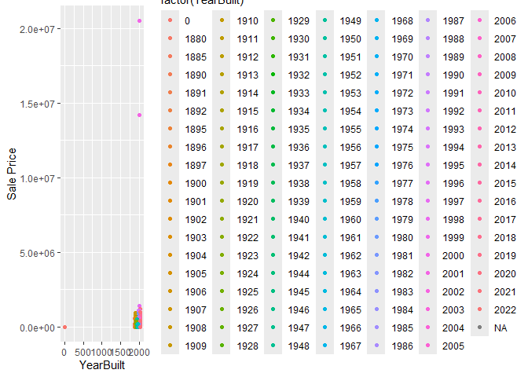
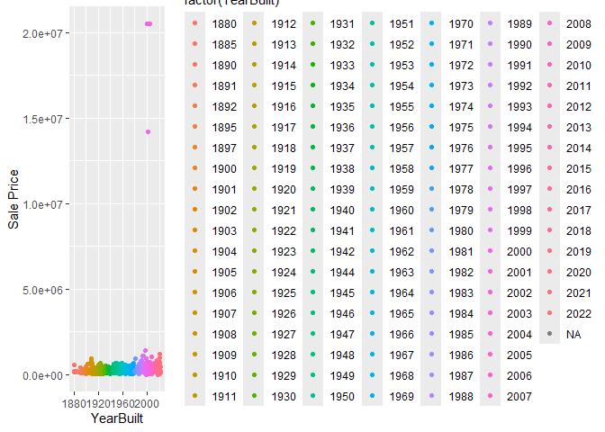

<!-- README.md is generated from README.Rmd. Please edit the README.Rmd file -->

# Lab report \#1

Follow the instructions posted at
<https://ds202-at-isu.github.io/labs.html> for the lab assignment. The
work is meant to be finished during the lab time, but you have time
until Monday evening to polish things.

Include your answers in this document (Rmd file). Make sure that it
knits properly (into the md file). Upload both the Rmd and the md file
to your repository.

All submissions to the github repo will be automatically uploaded for
grading once the due date is passed. Submit a link to your repository on
Canvas (only one submission per team) to signal to the instructors that
you are done with your submission.

``` r
library(ggplot2)
library(classdata)
head(ames, 50)
```

    ## # A tibble: 50 × 16
    ##    `Parcel ID` Address     Style Occupancy `Sale Date` `Sale Price` `Multi Sale`
    ##    <chr>       <chr>       <fct> <fct>     <date>             <dbl> <chr>       
    ##  1 0903202160  1024 RIDGE… 1 1/… Single-F… 2022-08-12        181900 <NA>        
    ##  2 0907428215  4503 TWAIN… 1 St… Condomin… 2022-08-04        127100 <NA>        
    ##  3 0909428070  2030 MCCAR… 1 St… Single-F… 2022-08-15             0 <NA>        
    ##  4 0923203160  3404 EMERA… 1 St… Townhouse 2022-08-09        245000 <NA>        
    ##  5 0520440010  4507 EVERE… <NA>  <NA>      2022-08-03        449664 <NA>        
    ##  6 0907275030  4512 HEMIN… 2 St… Single-F… 2022-08-16        368000 <NA>        
    ##  7 0535105180  511 25TH S… 1 St… Single-F… 2022-08-03             0 <NA>        
    ##  8 0907428446  4510 TWAIN… 1 St… Condomin… 2022-08-16        110000 <NA>        
    ##  9 0527301030  3409 EISEN… 1 St… Single-F… 2022-08-08        350000 <NA>        
    ## 10 0531363050  5426 KANSA… 1 St… Single-F… 2022-08-03        242000 <NA>        
    ## # ℹ 40 more rows
    ## # ℹ 9 more variables: YearBuilt <dbl>, Acres <dbl>,
    ## #   `TotalLivingArea (sf)` <dbl>, Bedrooms <dbl>,
    ## #   `FinishedBsmtArea (sf)` <dbl>, `LotArea(sf)` <dbl>, AC <chr>,
    ## #   FirePlace <chr>, Neighborhood <fct>

``` r
str(ames)
```

    ## tibble [6,935 × 16] (S3: tbl_df/tbl/data.frame)
    ##  $ Parcel ID            : chr [1:6935] "0903202160" "0907428215" "0909428070" "0923203160" ...
    ##  $ Address              : chr [1:6935] "1024 RIDGEWOOD AVE, AMES" "4503 TWAIN CIR UNIT 105, AMES" "2030 MCCARTHY RD, AMES" "3404 EMERALD DR, AMES" ...
    ##  $ Style                : Factor w/ 12 levels "1 1/2 Story Brick",..: 2 5 5 5 NA 9 5 5 5 5 ...
    ##  $ Occupancy            : Factor w/ 5 levels "Condominium",..: 2 1 2 3 NA 2 2 1 2 2 ...
    ##  $ Sale Date            : Date[1:6935], format: "2022-08-12" "2022-08-04" ...
    ##  $ Sale Price           : num [1:6935] 181900 127100 0 245000 449664 ...
    ##  $ Multi Sale           : chr [1:6935] NA NA NA NA ...
    ##  $ YearBuilt            : num [1:6935] 1940 2006 1951 1997 NA ...
    ##  $ Acres                : num [1:6935] 0.109 0.027 0.321 0.103 0.287 0.494 0.172 0.023 0.285 0.172 ...
    ##  $ TotalLivingArea (sf) : num [1:6935] 1030 771 1456 1289 NA ...
    ##  $ Bedrooms             : num [1:6935] 2 1 3 4 NA 4 5 1 3 4 ...
    ##  $ FinishedBsmtArea (sf): num [1:6935] NA NA 1261 890 NA ...
    ##  $ LotArea(sf)          : num [1:6935] 4740 1181 14000 4500 12493 ...
    ##  $ AC                   : chr [1:6935] "Yes" "Yes" "Yes" "Yes" ...
    ##  $ FirePlace            : chr [1:6935] "Yes" "No" "No" "No" ...
    ##  $ Neighborhood         : Factor w/ 42 levels "(0) None","(13) Apts: Campus",..: 15 40 19 18 6 24 14 40 13 23 ...

Q1:

Parcel ID chr character with ID.

Address chr property address in Ames, IA.

Style Factor factor variable detailing the type of housing.

Occupancy Factor factor variable of type of housing.

Sale Date Date date of sale.

Sale Price num sales price (in US dollar).

range: 0 to 20500000

Multi Sale chr logical value: was this sale part of a package?

YearBuilt num integer value: year in which the house was built.

range: 0 to 2022

Acres num acres of the lot.

range: 0 to 12.012

TotalLivingArea (sf) num total living area in square feet.

range: 0 to 6007

Bedrooms num number of bedrooms.

range: 0 to 10

FinishedBsmtArea (sf) num total area of the finished basement in square
feet.

range: 10 to 6496

LotArea(sf) num total lot area in square feet.

range: 0 to 523228

AC chr logical value: does the property have an AC?

FirePlace chr logical value: does the property have an fireplace?

Neighborhood Factor factor variable - levels indicate neighborhood area
in Ames.

## 2. is there a variable of special interest or focus?

The variable of special interest in this dataset is *Total Living Area*,
which reflects the total square footage of livable space in a home. This
variable is important because it plays a major role in home-buying
decisions and has a large impact on the Sale Price of a property

3:

``` r
ggplot(ames, aes(x=`Sale Price`)) + geom_histogram(binwidth = 500) + ggtitle("binwidth - 500")
```

<!-- -->

``` r
max(ames$`Sale Price`, na.rm=TRUE)
```

    ## [1] 20500000

The range of the variable Sale Price is 0-20,500,000. The highest value
is a very far outlier, which most Sale Price values lying between
100,000 and 500,000. Additionally, there were quite a few listed as 0.

4: Matthew: TotalLivingArea (sf)

``` r
library(ggplot2)
ggplot(data = ames, 
       aes(x = ames$"TotalLivingArea (sf)", y = ames$"Sale Price")) +
  geom_point()
```

    ## Warning: Use of `ames$"TotalLivingArea (sf)"` is discouraged.
    ## ℹ Use `TotalLivingArea (sf)` instead.

    ## Warning: Use of `ames$"Sale Price"` is discouraged.
    ## ℹ Use `Sale Price` instead.

    ## Warning: Removed 447 rows containing missing values or values outside the scale range
    ## (`geom_point()`).

<!-- --> Domain = 0
to 6007 Range = 0 to 20500000 It’s hard to see what the trend is with
outliers included, so I will make another graph without the outliers.

``` r
library(ggplot2)
ggplot(data = ames, 
       aes(x = ames$"TotalLivingArea (sf)", y = ames$"Sale Price")) +
  geom_point() +
  ylim(5000, 1200000) +
  xlim(50, 4000)
```

    ## Warning: Use of `ames$"TotalLivingArea (sf)"` is discouraged.
    ## ℹ Use `TotalLivingArea (sf)` instead.

    ## Warning: Use of `ames$"Sale Price"` is discouraged.
    ## ℹ Use `Sale Price` instead.

    ## Warning: Removed 3045 rows containing missing values or values outside the scale range
    ## (`geom_point()`).

<!-- --> Domain = 50
to 4000 Range = 5000 to 1200000 There is a trend that as the total
living area increases, so does the price of the house. The domain and
range was adjusted to exclude outliers listed in Q3. There are still
some other outliers floating around, but the overall trend stands.

## 4:

### Brianna

The variable I have chosen is “Year Built” and plotted it against “Sale
Price” in a scatter plot. The range of this variable is from 0-2022. As
the year built increases, the Sale Price generally also increases,
creating a positive correlation. The oddities of far outliers listed in
\#3 were also noted here, with the houses having a sale price of 0 also
having a 0 for Year Built. I removed these and created a second plot
demonstrating this.

``` r
ggplot(ames, aes(x=YearBuilt, y=`Sale Price`, na.rm = TRUE)) + geom_point(aes(color=factor(YearBuilt)))
```

    ## Warning: Removed 447 rows containing missing values or values outside the scale range
    ## (`geom_point()`).

<!-- -->

``` r
ggplot(ames[which(ames$`Sale Price` < 2000) & ames$`Sale Price` > 0,], aes(x=YearBuilt, y=`Sale Price`, na.rm = TRUE)) + geom_point(aes(color=factor(YearBuilt)))
```

    ## Warning in which(ames$`Sale Price` < 2000) & ames$`Sale Price` > 0: longer
    ## object length is not a multiple of shorter object length

    ## Warning: Removed 365 rows containing missing values or values outside the scale range
    ## (`geom_point()`).

<!-- -->

# Analysis by Umesh Sai Teja Poola

### Analysis of Sale Price vs Year Built

``` r
# Scatter plot of Sale Price against Year Built
ggplot(na.omit(ames), aes(x = YearBuilt, y = `Sale Price`)) +
  geom_point() +
  ggtitle("Sale Price vs Year Built") +
  xlab("Year Built") +
  ylab("Sale Price")
```

<!-- -->

``` r
# Summary of Year Built range
summary(ames$YearBuilt)
```

    ##    Min. 1st Qu.  Median    Mean 3rd Qu.    Max.    NA's 
    ##       0    1956    1978    1976    2002    2022     447

From the scatter plot, it can be observed that homes built in more
recent years tend to have higher sale prices. However, there are a few
older homes with high sale prices, possibly due to renovations or
historical significance. The summary of the YearBuilt variable shows a
wide range of construction dates, with the oldest homes built in the
early 1900s and the newest built in recent years.
